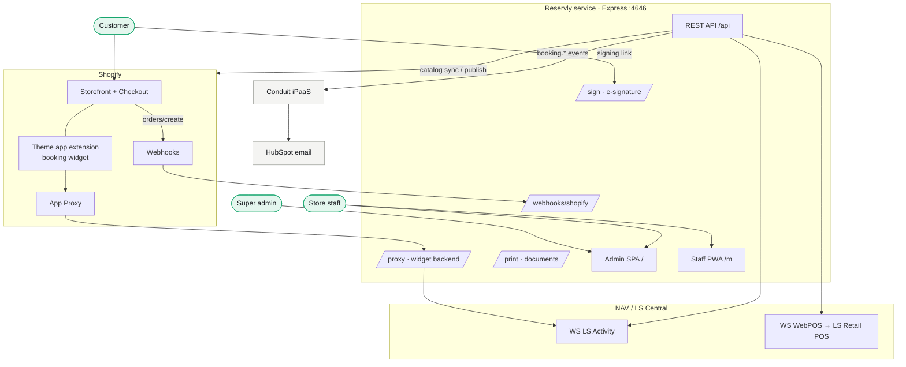
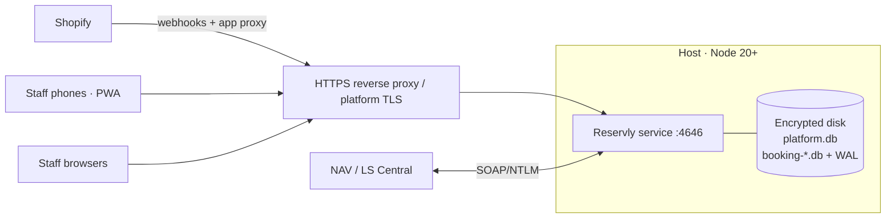
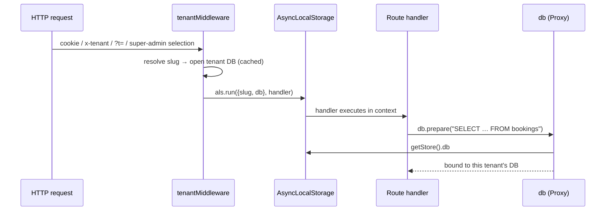
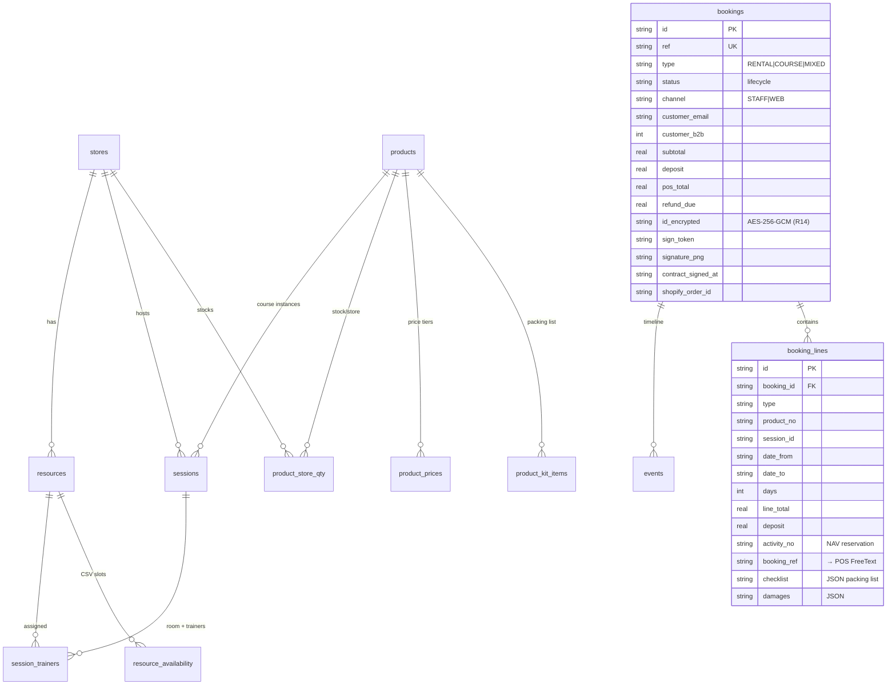
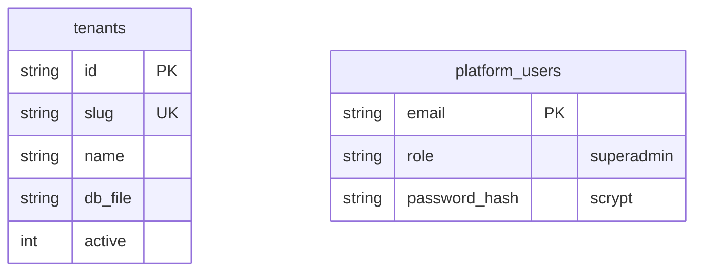
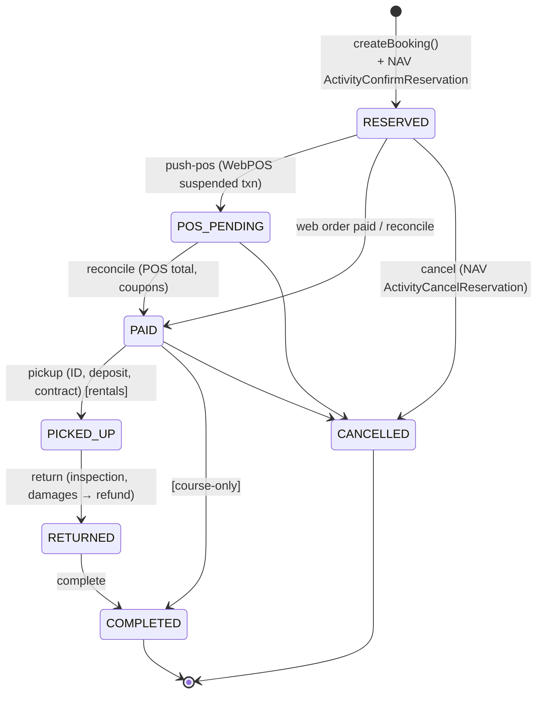
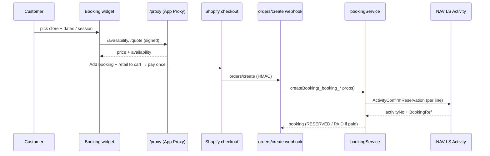

# Reservly — Architecture

**Audience:** engineers and integrators working on or around Reservly.
Companion to [REQUIREMENTS.md](./REQUIREMENTS.md). Operational detail lives in
[../DEPLOYMENT.md](../DEPLOYMENT.md), [../RUNNING.md](../RUNNING.md),
[../API.md](../API.md), and [../PRIVACY.md](../PRIVACY.md).

---

## 1. System context

Reservly sits between the Shopify storefront (customers) and NAV / LS Central
(system of record), with staff surfaces on top and event fan-out to Conduit.



---

## 2. Components

| Component | Tech | Path | Responsibility |
|---|---|---|---|
| **API server** | Express + better-sqlite3 (TS, ESM, `tsx`) | `server/` | Domain logic, integrations, all HTTP surfaces |
| **Booking Desk** | React + Vite SPA | `web/` | Staff/manager back office (`/`) |
| **Staff app** | React + Vite PWA | `mobile/` | Floor staff on phones (`/m`) |
| **Booking widget** | Shopify theme app extension (Liquid + vanilla JS) | `extensions/booking-widget/` | Storefront rental/course booking UI |
| **Shopify app config** | `shopify.app.toml` | root | App URLs, scopes, webhooks, app proxy |

One Node process serves everything on `PORT` (4646). The SPAs are built to
`web/dist` and `mobile/dist` and served statically; in dev they run on Vite
(`5646`/`5647`) and proxy `/api` to the server.

### Tech-stack rationale
- **SQLite (better-sqlite3)** — zero-ops, synchronous, fast; per-tenant files give
  hard isolation. Mirrors the sibling Conduit project's stack.
- **AsyncLocalStorage tenant proxy** — multi-tenancy without threading `tenant_id`
  through every query (see §4).
- **No ORM** — hand-written SQL in thin route/lib modules; the schema is small and
  stable.
- **PWA over native** — installable on Android/iOS from a URL, instant updates, one
  codebase; Capacitor wrap remains possible for store distribution.

---

## 3. Deployment topology



State is entirely on-disk SQLite — no external database. The disk must be
persistent and encrypted; back up the `.db*` files (see DEPLOYMENT §5).

---

## 4. Multi-tenancy

**One SQLite database per tenant**, selected per request. Existing Gosselin data is
the `gosselin` tenant (`booking.db`); new tenants get `booking-<slug>.db`. A separate
`platform.db` holds the tenant registry and super-admin accounts.

The trick that keeps every existing query tenant-unaware: `db` is a **Proxy** backed
by `AsyncLocalStorage`. Request middleware runs the handler inside a tenant context;
`db.prepare(...)` transparently resolves to that tenant's database. Outside a request
(boot, schedulers) it falls back to the default tenant.



Tenant resolution priority: **super-admin's selected tenant → `x-tenant` header /
`?t=` (public surfaces like signing links) → default (`gosselin`)**.

Files: `server/db.ts` (proxy + `initSchema`), `server/lib/platform.ts`
(registry, tenant DB cache, `tenantMiddleware`, super-admin sessions).

---

## 5. Data model

### Per-tenant database (`booking-<slug>.db`)



Other tables: `settings` (per-tenant key/value: NAV/Shopify/POS config, retention,
staff password hash, contract template), `audit_log` (personal-data access),
`webhooks` (outbound subscriptions).

### Platform database (`platform.db`)



---

## 6. Booking lifecycle



Each transition emits a `booking.*` event (§8). `bookingService.ts` owns creation
+ serialization for both channels; `routes/booking.ts` owns the transitions.

---

## 7. Engines

### Pricing (`engine/pricing.ts`) — R3A
Rentals bill in whole days: `days = max(1, ceil(hours / 24))` (25h ⇒ 2 days). A
`WEEKLY` tier from NAV `ActivityProductPrice` is applied per full 7-day block when it
beats 7× the daily rate. Deposits come from the product's `security_deposit`.

### Availability (`engine/availability.ts`)
- **Rental:** per-store stock minus overlapping active booking lines, evaluated per
  calendar day. In live mode, cross-checked against NAV `GetActivityAvailability`
  (takes the conservative minimum) so unpaid web carts can't double-book.
- **Course:** session capacity minus booked seats across active bookings.

---

## 8. Integrations

### 8.1 NAV / LS Central (SOAP over NTLM) — `server/lib/nav.ts`
Envelopes mirror the Gosselin middleware connector (`packages/connectors`).
`navMode=mock` (default without credentials) answers locally so the whole flow runs
offline; `live` sends NTLM-authenticated SOAP.

| Operation | NAV function | Use |
|---|---|---|
| Catalog | `GetActivityType`, `GetActivityProducts` | Sync rentals/courses (R0) |
| Availability | `GetActivityAvailability` | Live rental availability |
| Reserve | `ActivityConfirmReservation` | On booking create (R4–R5); returns activityNo + BookingRef |
| Cancel | `ActivityCancelReservation` | On booking cancel |
| POS | `WebPosPost` (WSWebPOS) | Suspended transaction (R3B): Item line at reserved amount + FreeText line carrying BookingRef (payment trigger) |

### 8.2 Shopify — `server/lib/shopifyAdmin.ts` + `routes/integration.ts`
- **Admin API** via **client-credentials grant** (own-org app on own store → the
  server mints its own 24h token; no OAuth redirect). Used to ensure metafield
  definitions, create/update products (`productSet`), and publish to channels
  (`publishablePublish`).
- **App Proxy** (`/proxy/*`) — storefront widget calls `/apps/booking/*` on the shop;
  Shopify signs and forwards. Signature verified server-side.
- **`orders/create` webhook** (`/webhooks/shopify/orders-create`) — HMAC-verified;
  reads `_booking_*` line-item properties and creates the booking + NAV reservation
  (WEB channel). B2B (customer tag) orders arrive unpaid → stay `RESERVED`.
- **Mandatory GDPR webhooks** (`/webhooks/shopify/compliance`) —
  `customers/data_request`, `customers/redact`, `shop/redact`; 401 on bad HMAC.
- **Theme app extension** — the booking widget (metafield-gated: renders only for
  products carrying `booking.type`).

### 8.3 Conduit / HubSpot — `server/lib/events.ts`
Every `booking.*` event is logged locally, dispatched to outbound webhooks (§8.4),
and POSTed to Conduit (`CONDUIT_URL`), which owns HubSpot transactional email
(R6/R19, class steps 11/17). Fire-and-forget — never blocks the in-store flow.

### 8.4 Outbound webhooks — `server/lib/webhooks.ts`
Any URL can subscribe (event filter + optional HMAC secret). Each delivery carries
the **full booking snapshot** (no callback needed), `X-Booking-Signature` when a
secret is set, one retry, last-status recorded. This is how Conduit (or any system)
extracts bookings to publish onward.

---

## 9. Key flows

### 9.1 Web booking (one-cart checkout)



### 9.2 In-store fulfilment → POS

```mermaid
sequenceDiagram
  participant St as Staff (Desk / PWA)
  participant API as /api
  participant POS as WebPOS → LS Retail POS
  St->>API: push-pos
  API->>POS: suspended txn (Item + FreeText BookingRef)
  Note over St,POS: staff completes at till;<br/>coupons may change total
  St->>API: reconcile(posTotal)
  St->>API: pickup(ID enc, deposit, checklist, signature)
  St->>API: return(inspection, damages) → refundDue
  St->>API: complete
```

### 9.3 Customer e-signature — `routes/sign.ts`
`request-signature` mints a one-time token → link (emailed via Conduit/HubSpot or
shown by staff) → public `/sign/:token` page renders the contract + a canvas
signature pad → `POST` stores the PNG + name, marks `contract_signed_at`, emits
`booking.contract_signed`. Token-authenticated (no staff login); carries `?t=<slug>`
for non-default tenants.

---

## 10. Security model

| Surface | Auth |
|---|---|
| Booking Desk `/`, mobile `/m`, `/api`, `/print` | Staff password (scrypt, ≥12 chars, 12h HttpOnly session cookie). Open endpoints: `health`, `auth`, `login`, `logout`. |
| `/api/admin/*` | Platform super-admin session (separate cookie); passes every tenant's staff gate. |
| `/proxy/*` | Shopify App Proxy signature (HMAC). |
| `/webhooks/shopify/*` | Shopify webhook HMAC; 401 on mismatch. |
| `/sign/:token` | Unguessable 24-byte token = the credential; no login. |
| Government ID | AES-256-GCM at rest (`BOOKING_ENC_KEY`); last-4 only surfaced. |

Access to personal data (logins incl. failures, booking views, exports, redactions)
is written to `audit_log`. Retention sweeps run daily. Full mapping in PRIVACY.md.

---

## 11. Module map

```
server/
  index.ts            app wiring, tenant middleware, static SPA serving, schedulers
  db.ts               tenant proxy + schema (initSchema), settings, audit, helpers
  seed.ts             dev catalog seed (mock NAV)
  engine/
    pricing.ts        day-based pricing + weekly tiers (R3A)
    availability.ts   rental (per-store) + course (capacity) availability
  lib/
    platform.ts       tenant registry, tenant DB cache, super-admin, tenantMiddleware
    bookingService.ts createBooking + serialize (WEB + STAFF), status transitions
    nav.ts            LS Activity + WebPOS SOAP client (mock/live)
    shopifyAdmin.ts   Admin API (client-credentials), product publish, channels
    events.ts         emit → audit + outbound webhooks + Conduit
    webhooks.ts       outbound webhook delivery (HMAC, retry)
    crypto.ts         AES-256-GCM government-ID encryption
    auth.ts           staff password gate + sessions
    privacy.ts        retention sweep, redact, data export (GDPR)
  routes/
    catalog.ts        stores, products, sync, publish, sessions, resources
    booking.ts        availability, quote, bookings + lifecycle, dashboard, checklist, sign request
    integration.ts    settings, health, auth, privacy, audit, webhooks, Shopify webhooks + proxy
    print.ts          contract / packing-list / confirmation / daily (+ template)
    sign.ts           public e-signature page + submit
    admin.ts          super-admin: tenants CRUD, use-tenant
web/     Booking Desk SPA (pages/, components/)
mobile/  Staff PWA (App.tsx = login, list, detail, checklist, sign, standby)
extensions/booking-widget/  storefront theme app extension
```

Full endpoint list: [../API.md](../API.md).

---

## 12. Known constraints & roadmap

- **Storefront widget in dev** — `shopify app dev` doesn't update the app-proxy URL
  and the tunnel URL is ephemeral (Shopify CLI #990); run `scripts/set-proxy-url.sh`
  after restarts. Stable in production (one-time `shopify app deploy`).
- **External multi-merchant onboarding** — current tenancy fits one org/many brands.
  A public install flow needs the Shopify **authorization-code OAuth grant** + tenant
  routing by **shop domain** (map `shop → tenant` instead of defaulting), and
  per-tenant Shopify credentials (already stored per-tenant in `settings`).
- **Single shared staff credential per tenant** — v1 uses one staff password per
  tenant; per-user staff accounts + roles are a future addition.
